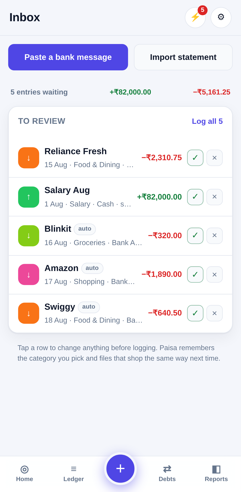
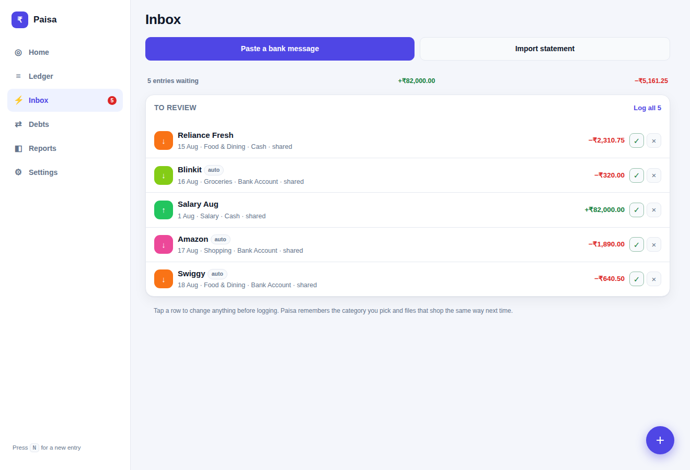

# Paisa — every rupee accounted for

A personal money tracker for **spending, earnings and debts**. One app that runs on
your phone and your laptop, works with no internet, and keeps its data on your own
device — no account, no server, no one else reading your ledger.

| Phone | Laptop |
|---|---|
|  |  |
|  |  |
|  |  |

---

## Getting it running

### Quickest — just open it
Download this folder and double-click `index.html`. It works immediately, in any
modern browser.

### On a laptop, from the repo
```bash
cd finance-tracker
python3 -m http.server 8000
# open http://localhost:8000
```

### On your phone (the proper way)
The app installs to your home screen like a normal app, but browsers only allow
that over HTTPS. The simplest free host is GitHub Pages:

1. In this repo, go to **Settings → Pages** and set **Source** to **GitHub Actions**.
2. Merge this branch into `main`. The included workflow
   (`.github/workflows/deploy-finance-tracker.yml`) publishes the app.
3. Open the published URL on your phone and choose:
   - **Android / Chrome** — menu → *Add to Home screen* / *Install app*
   - **iPhone / Safari** — share button → *Add to Home Screen*

Once installed it opens full screen, launches instantly, and keeps working with
the phone in flight mode.

---

## How the money model works

Most trackers get debts wrong: they count borrowed money as income and lending as
spending, so your "spent this month" figure is nonsense. Paisa keeps seven distinct
kinds of movement.

| Entry | Money | Counts as | Also does |
|---|---|---|---|
| **Spent** | out | spending | — |
| **Earned** | in | earnings | — |
| **Transfer** | between your accounts | neither | — |
| **Lent out** | out | neither | creates/increases what someone owes you |
| **Borrowed** | in | neither | creates/increases what you owe |
| **Got back** | in | neither¹ | reduces what they owe you |
| **Repaid** | out | neither¹ | reduces what you owe |

¹ Except the **interest** portion. When you record a repayment you can say how much
of it was interest — that slice counts as real income or a real expense (filed under
*Interest Received* / *Interest Paid*), while the rest just clears the principal.

Because of this:

- **Money in hand** = opening balances + everything in − everything out.
- **Net worth** = money in hand + what people owe you − what you owe.
- **Spent this month** is only actual spending, never a loan you repaid.

Amounts are stored as **integer paise**, so nothing is ever lost to rounding —
₹420.50 stays ₹420.50 forever.

---

## What's in it

- **Inbox** — everything captured automatically, waiting for one tap.
- **Home** — money in hand, net worth, this month's earned/spent/saved, budget
  progress, what you owe and are owed, top spending categories, recent entries.
- **Ledger** — every entry, grouped by day with a daily net; search by note, person,
  account or amount; filter by type, month and account.
- **Debts** — per-person balances for both directions, due dates with overdue
  warnings, repayment history, and progress towards clearing each one.
- **Reports** — 12-month earned-vs-spent trend, category breakdown with a donut and
  shares, income sources, and per-account balances.
- **Settings** — accounts, categories, budget, pay-cycle month start, theme, and
  backup/restore.

Small things that make daily logging fast: a big amount pad with +50/+100/+500/+1000/+5000
quick buttons, Enter to save, `N` on a laptop to open a new entry, and a
month-start setting so "this month" follows your salary date instead of the calendar.

## Automatic logging

Typing every entry is what kills a tracker after three weeks. Four ways to avoid it,
in the order they save you the most effort.

### 1. Repeating entries — zero effort
Rent, salary, EMIs, SIPs, subscriptions. Set them up once in
**Settings → Repeating entries** with an amount and a day of the month (or week).
They appear on schedule by themselves; tick *Log it automatically* and they never
even ask. Missed periods are caught up the next time you open the app, and nothing
is ever posted twice.

### 2. Share a bank SMS — two taps
With Paisa installed to your home screen, long-press a bank message in your SMS app
→ **Share** → **Paisa**. It arrives already read: amount, direction, date, shop,
and which of your accounts it came from. Tap ✓ to log it.

### 3. Paste a batch — for catching up
**Inbox → Paste a bank message** takes one message or fifty at once, one per line or
separated by blank lines. A live preview shows what each will become before you
commit.

### 4. Import a statement — for backfilling months
**Inbox → Import statement** reads a CSV from your bank. Column layouts differ by
bank — separate Debit/Credit columns, a single signed Amount, a Dr/Cr marker, junk
rows above the header — and all of that is worked out for you.

### The inbox, and how it learns

Nothing reaches your ledger unreviewed. Everything captured waits in the **Inbox**
with a suggested category, and you either tap ✓ or tap the row to change something
first.

Each time you file something, Paisa remembers it: file `swiggy@icici` under
*Food & Dining* once and every later Swiggy message is pre-filed that way. The same
happens for accounts — confirm that a message ending `A/c XX1234` is your HDFC
account, and later messages from that account land there automatically. What it has
learned is listed under **Settings → Learned categories**, and you can forget any of
it with one tap.

Once the suggestions look right, turn on **Log straight away when I have filed that
shop before** and known shops skip the inbox entirely. It stays off until you say so.

Safety rails, because automation that quietly invents entries is worse than typing:

- **Duplicates are refused.** Each message is fingerprinted by its bank reference,
  so re-pasting the same batch or re-importing an overlapping statement adds nothing.
- **Non-transactions are dropped**, with the reason shown: OTPs, bill reminders,
  failed payments, payment requests, promotional offers, "will be debited" notices.
- **Balance figures are never mistaken for the amount** — "Avl Bal Rs.98,765" in the
  same message does not become a ₹98,765 expense.

### What this cannot do

**Paisa cannot read your SMS inbox by itself.** No browser gives a web app that
permission — only a native Android app can. So bank messages need that one share
tap. If you want fully hands-free capture, that requires a native Android companion
app, which is a separate build from this one.

### When a message is not read correctly

Bank formats vary and change. The reader is covered by tests you can extend:

```bash
cd finance-tracker/tests
node parse.test.mjs
```

Add your bank's message with the result you expect, run it, and adjust the patterns
in `js/parse.js` until it passes. See `tests/README.md`.

## Moving data between your phone and laptop

Data lives in the browser's local storage on each device, so the two do not sync by
themselves. To move it: **Settings → Export backup (.json)**, send yourself the file,
then on the other device **Settings → Import**.

- **Merge in** — adds anything the device hasn't seen, keeps what's already there.
  Safe to run repeatedly; entries already present are skipped by id.
- **Replace everything** — wipes the device and restores the file exactly.

**Export ledger (.csv)** gives you every entry in a spreadsheet-friendly form.

Keep a backup somewhere safe. Clearing your browser's site data deletes the ledger,
and there is no copy on any server to fall back on.

> **Want true automatic sync?** That needs a server holding your data plus a login,
> which is a different piece of software from this one. The storage layer
> (`js/store.js`) is deliberately the only thing that touches persistence, so it can
> be pointed at a backend later without rewriting the screens.

## Files

```
finance-tracker/
├── index.html              app shell
├── css/app.css             all styling, light + dark
├── js/store.js             data model, money maths, inbox, rules, backup
├── js/parse.js             reads bank / UPI messages
├── js/statement.js         reads bank statement CSVs
├── js/util.js              rupee + date formatting, DOM helpers
├── js/charts.js            SVG donut and bar charts (no libraries)
├── js/views.js             screen rendering
├── js/app.js               routing, forms, event handling
├── sw.js                   offline caching
├── manifest.webmanifest    install metadata
└── tools/make_icons.py     regenerates the app icons
```

No build step, no dependencies, no tracking. Roughly 4,500 lines you can read.

## Privacy

Nothing leaves your device. There is no analytics, no network call of any kind, and
no account. Bank messages you share into the app are parsed on the device and never
transmitted. The only data that ever moves is the backup file you export yourself.
