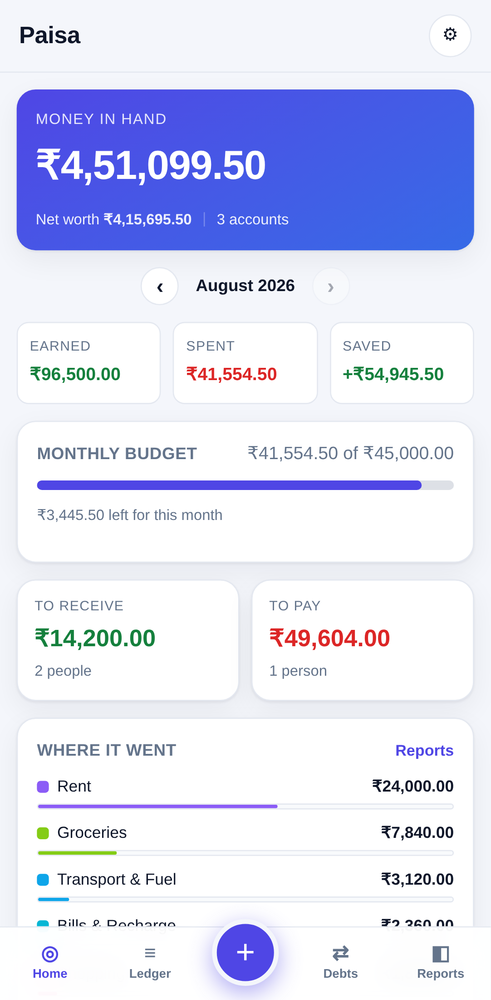
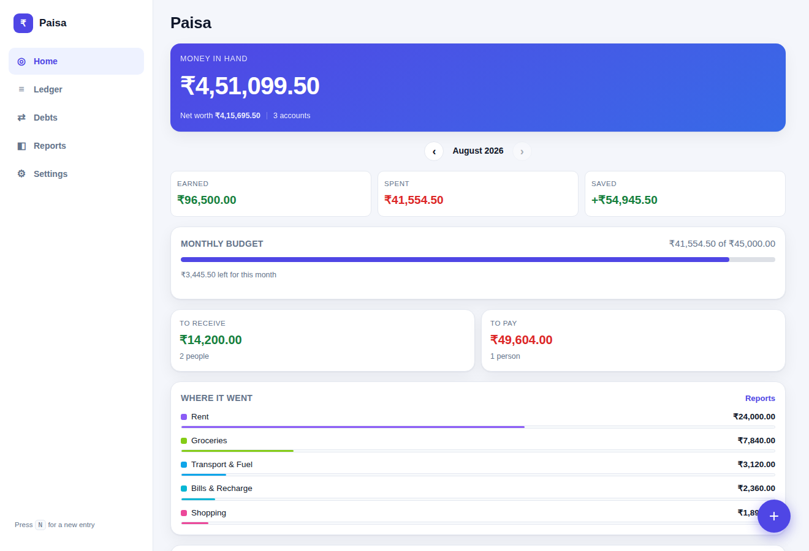
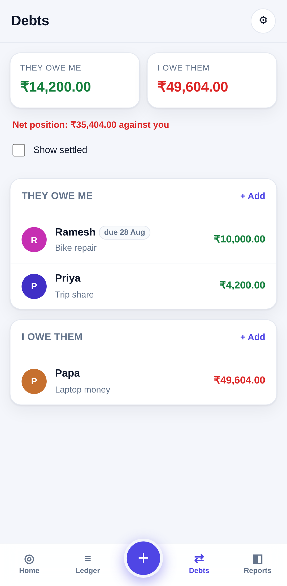
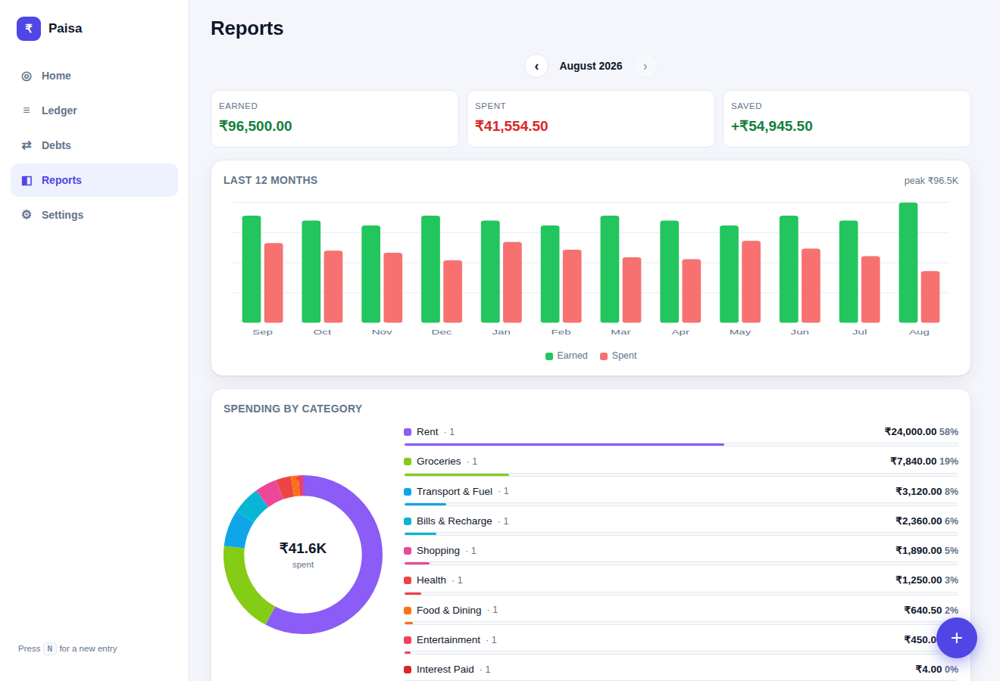

# Paisa — every rupee accounted for

A personal money tracker for **spending, earnings and debts**. One app that runs on
your phone and your laptop, works with no internet, and keeps its data on your own
device — no account, no server, no one else reading your ledger.

| Phone | Laptop |
|---|---|
|  |  |
|  |  |

---

## Getting it running

### Quickest — just open it
Download this folder and double-click `index.html`. It works immediately, in any
modern browser.

### On a laptop, from the repo
```bash
cd finance-tracker
python3 -m http.server 8000
# open http://localhost:8000
```

### On your phone (the proper way)
The app installs to your home screen like a normal app, but browsers only allow
that over HTTPS. The simplest free host is GitHub Pages:

1. In this repo, go to **Settings → Pages** and set **Source** to **GitHub Actions**.
2. Merge this branch into `main`. The included workflow
   (`.github/workflows/deploy-finance-tracker.yml`) publishes the app.
3. Open the published URL on your phone and choose:
   - **Android / Chrome** — menu → *Add to Home screen* / *Install app*
   - **iPhone / Safari** — share button → *Add to Home Screen*

Once installed it opens full screen, launches instantly, and keeps working with
the phone in flight mode.

---

## How the money model works

Most trackers get debts wrong: they count borrowed money as income and lending as
spending, so your "spent this month" figure is nonsense. Paisa keeps seven distinct
kinds of movement.

| Entry | Money | Counts as | Also does |
|---|---|---|---|
| **Spent** | out | spending | — |
| **Earned** | in | earnings | — |
| **Transfer** | between your accounts | neither | — |
| **Lent out** | out | neither | creates/increases what someone owes you |
| **Borrowed** | in | neither | creates/increases what you owe |
| **Got back** | in | neither¹ | reduces what they owe you |
| **Repaid** | out | neither¹ | reduces what you owe |

¹ Except the **interest** portion. When you record a repayment you can say how much
of it was interest — that slice counts as real income or a real expense (filed under
*Interest Received* / *Interest Paid*), while the rest just clears the principal.

Because of this:

- **Money in hand** = opening balances + everything in − everything out.
- **Net worth** = money in hand + what people owe you − what you owe.
- **Spent this month** is only actual spending, never a loan you repaid.

Amounts are stored as **integer paise**, so nothing is ever lost to rounding —
₹420.50 stays ₹420.50 forever.

---

## What's in it

- **Home** — money in hand, net worth, this month's earned/spent/saved, budget
  progress, what you owe and are owed, top spending categories, recent entries.
- **Ledger** — every entry, grouped by day with a daily net; search by note, person,
  account or amount; filter by type, month and account.
- **Debts** — per-person balances for both directions, due dates with overdue
  warnings, repayment history, and progress towards clearing each one.
- **Reports** — 12-month earned-vs-spent trend, category breakdown with a donut and
  shares, income sources, and per-account balances.
- **Settings** — accounts, categories, budget, pay-cycle month start, theme, and
  backup/restore.

Small things that make daily logging fast: a big amount pad with +50/+100/+500/+1000/+5000
quick buttons, Enter to save, `N` on a laptop to open a new entry, and a
month-start setting so "this month" follows your salary date instead of the calendar.

## Moving data between your phone and laptop

Data lives in the browser's local storage on each device, so the two do not sync by
themselves. To move it: **Settings → Export backup (.json)**, send yourself the file,
then on the other device **Settings → Import**.

- **Merge in** — adds anything the device hasn't seen, keeps what's already there.
  Safe to run repeatedly; entries already present are skipped by id.
- **Replace everything** — wipes the device and restores the file exactly.

**Export ledger (.csv)** gives you every entry in a spreadsheet-friendly form.

Keep a backup somewhere safe. Clearing your browser's site data deletes the ledger,
and there is no copy on any server to fall back on.

> **Want true automatic sync?** That needs a server holding your data plus a login,
> which is a different piece of software from this one. The storage layer
> (`js/store.js`) is deliberately the only thing that touches persistence, so it can
> be pointed at a backend later without rewriting the screens.

## Files

```
finance-tracker/
├── index.html              app shell
├── css/app.css             all styling, light + dark
├── js/store.js             data model, money maths, backup/restore
├── js/util.js              rupee + date formatting, DOM helpers
├── js/charts.js            SVG donut and bar charts (no libraries)
├── js/views.js             screen rendering
├── js/app.js               routing, forms, event handling
├── sw.js                   offline caching
├── manifest.webmanifest    install metadata
└── tools/make_icons.py     regenerates the app icons
```

No build step, no dependencies, no tracking. Roughly 3,000 lines you can read.

## Privacy

Nothing leaves your device. There is no analytics, no network call of any kind, and
no account. The only data that ever moves is the backup file you export yourself.
